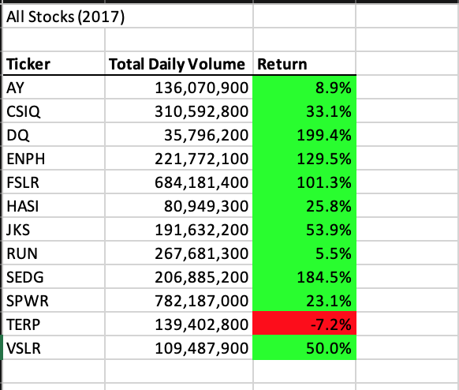

# stock-analysis-databootcamp

## Overview of Project
My client Steve would like to analyze the performance of various stocks for a given year. Using the provided data I created a VBA script to determine the total daily volume for the year and the percetage return for each ticker. The goal was to make the code run as quickly as possible so it could potentially be reused on very large data sets in the future. 

## Results
The 2 metrics generated by the script were the total daily volume and the overal return for a year. 

The total daily volume was caluclated by summing daily volume for each row for a particular ticker.
```
tickerVolumes(tickerIndex) = tickerVolumes(tickerIndex) + Cells(i, volCol).Value
```

The return for the year was calculated by dividing the closing price from the last day of the year by the closing price from the first day, then subtracking 1 to get the percentage increase. 
```
Cells(outputRow, 3).Value = (tickerEndingPrices(i) / tickerStartingPrices(i)) - 1
```

### Comparison of 2017 and 2018 results
As you can see below, in 2017 all the tickers had a positive return except TERP with a -7.2% return. The top performing stock was DQ with an almost 200% return and interestingly DQ also had the lowest total daily volume. Five of the stocks, DW, ENPH, FSLR, and SEDG, had triple digits returns.



2018 had very different results. Almost across the board the stocks performed much worse in 2018 than 2017 with only two, ENPH, and RUN, having a positive return 2018. None of the stocks had a triple digit return in 2018. The top performer from 2017, DQ, had the worst performance from the group in 2018 with a return of -62.6% and approximately 3x the volume from 2017. 


RUN was the only stock from the group which not only had a positive return both years but also increased its return year over year from 2017 and 2018. Based on this data RUN might be the best stock to invest in going forward.

### Script execution comparison
My original script was able to analyze each year's data in approximately 0.22 seconds each. The refactored script cut that time in half to apprimxately 0.11 seconds. 
#### Original Performance


#### Refactored Performance


## Summary
### Pros and Cons of refactoring code in general
There can be various incentices to refactoring code. The most common would be to make it run more efficiently by optimizing memory usage and/or run time. The advantage would be that it runs faster and could scale to larger datasets. A possible disavantage would be that it becomes less readable due to more complex code patterns that helped make it more efficient. In theory you could also do the opposite and refeactor code to make it more readable possibly at the expense of performance. You would only do this when performance is not important and the goal is to make it more extensible by other coders. 

### Comparison between the original script and the refactored version
In my original script I actually deviated from the pattern in the module slightly. Instead of hardcoding the tickers in an array, I just iterated through the dataset and detected when a new ticker was found and then outputed the results when I detected the next row was a different ticker. This had the advantage of being able to be used on any dataset without knowing which tickers were included ahead of time. However, because the number of tickers was not hardcoded, I could not create correctly sized arrays ahead of time to store the results. This necessitated switching back and forth between the data sheet and the output sheet to store the results as it iterated. I suspect this switching between sheets was one cause of the decreased performance compared to the new script that interated the data sheet completely and then outputted the results in a second loop. 
